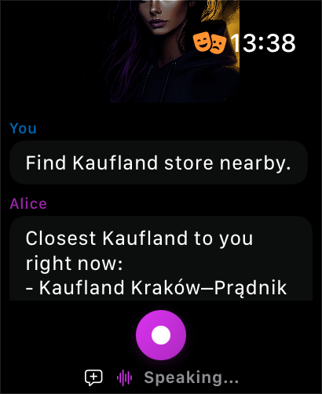

# Google Maps MCP Server

Streamable HTTP MCP server for Google Maps — search places, get details, and plan routes.

> **Release status (2026-07-27):** this repository pins `@modelcontextprotocol/server` and the test-only `@modelcontextprotocol/client` to `2.0.0-beta.5`, with Zod 4 and the candidate `2026-07-28` protocol. The dated protocol and stable v2 SDK are not final at this commit; do not claim final conformance until the release gate is verified.

The Bun and Cloudflare Workers entry points share one fetch-native handler per deployment and create a fresh MCP server for every request. Modern HTTP is stateless; compatibility with 2025-era clients uses the SDK's stateless fallback and does not create MCP sessions.

**Repository:** [github.com/iceener/maps-streamable-mcp-server](https://github.com/iceener/maps-streamable-mcp-server)

Author: [overment](https://x.com/_overment)

## Use Case

This MCP server is designed for **location-aware AI agents** running on mobile devices like Apple Watch or iPhone. Your client provides the current position, and the AI can:

- Find nearby places (restaurants, stores, gas stations)
- Get directions with turn-by-turn navigation
- Compare distances to multiple destinations
- Check opening hours and ratings before you arrive



It also pairs well with other MCP tools — for example, combining with a **Tesla MCP** to set navigation destinations directly in your car.

## Notice

This repo works in two ways:
- As a fetch-native **Bun server** for local workflows
- As a fetch-native **Cloudflare Worker** for remote interactions

## Features

- ✅ **Places** — Search nearby places, restaurants, landmarks by text or type
- ✅ **Details** — Get hours, ratings, reviews, photos, contact info
- ✅ **Routes** — Calculate walking, driving, transit directions
- ✅ **Distance Matrix** — Compare distances to multiple destinations
- ✅ **Location-aware** — All tools work with your current position
- ✅ **Dual Runtime** — Node.js/Bun or Cloudflare Workers

### Design Principles

- **LLM-friendly**: Unified tools, not 1:1 API mirrors
- **Watch-ready**: Designed for AI agents with location context
- **Smart defaults**: 1km radius, 10 results, walking mode
- **Clear feedback**: Place IDs visible for follow-up queries

---

## Installation

Prerequisites: [Bun](https://bun.sh/), [Google Cloud](https://console.cloud.google.com) project.

### 0. Client Setup
Your client needs to be aware of the current time and your current location, as both values will be used for searching and planning.

### 1. Get Google Maps API Key

1. Go to [Google Cloud Console](https://console.cloud.google.com)
2. Create a new project (or select existing)
3. Navigate to **APIs & Services > Library**
4. Enable **Places API (New)** and **Routes API**
5. Go to **APIs & Services > Credentials**
6. Click **Create Credentials > API Key**
7. (Recommended) Restrict key to Places API and Routes API

### 2. Local Development

```bash
cd google-maps-mcp
bun install
cp .env.example .env
```

Edit `.env`:

```env
PORT=3000
AUTH_ENABLED=true
AUTH_STRATEGY=bearer

# Generate with: openssl rand -hex 32
BEARER_TOKEN=your-random-auth-token

# Your Google Maps API key
API_KEY=your-google-maps-api-key
```

Run:

```bash
bun dev
# MCP: http://127.0.0.1:3000/mcp
```

### 3. Cloudflare Worker (Deploy)

1. Update `wrangler.jsonc` for the production URL and exact Host/Origin allowlists. The checked-in values are local-safe defaults. The existing `TOKENS` binding is retained for deployment compatibility but is not used for MCP sessions.

2. Set secrets:

```bash
# Auth token for clients (generate it using: openssl rand -hex 32). This makes the connection to your MCP not open to everyone, but only to those who have this API key.
wrangler secret put BEARER_TOKEN

# Your Google Maps API key
wrangler secret put API_KEY
```

3. Validate generated types and deploy:

```bash
bun run types:worker
bun run types:worker:check
bun run build:worker
bun run deploy
```

Endpoint: `https://<worker-name>.<account>.workers.dev/mcp`

---

## Client Configuration

### Claude Desktop / Cursor (Local)

```json
{
  "mcpServers": {
    "google-maps": {
      "command": "npx",
      "args": ["mcp-remote", "http://localhost:3000/mcp", "--transport", "http-only"],
      "env": { "NO_PROXY": "127.0.0.1,localhost" }
    }
  }
}
```

### Claude Desktop / Cursor (Cloudflare Worker)

```json
{
  "mcpServers": {
    "google-maps": {
      "command": "npx",
      "args": ["mcp-remote", "https://your-worker.workers.dev/mcp", "--transport", "http-only"]
    }
  }
}
```

### Alice App

Add as MCP server with:
- URL: `https://your-worker.workers.dev/mcp`
- Type: `streamable-http`
- Header: `Authorization: Bearer <your-BEARER_TOKEN>`

---

## Tools

### `search_places`

Find places by text query or type near a location.

```ts
// Input
{
  query?: string;              // "sushi near Central Park"
  location: {                  // Required: your current position
    latitude: number;
    longitude: number;
  };
  types?: string[];            // ["restaurant", "cafe"]
  radius?: number;             // Meters (default: 1000, max: 50000)
  open_now?: boolean;
  min_rating?: number;         // 0-5
  price_levels?: Array<"FREE" | "INEXPENSIVE" | "MODERATE" | "EXPENSIVE" | "VERY_EXPENSIVE">;
  max_results?: number;        // Default: 10, max: 20
  sort_by?: "distance" | "rating" | "relevance";
}

// Output
- Restaurant Name (500m) ★4.5(234) $$ 🟢 Open
  123 Main St, New York
  ID: ChIJN1t_tDeuEmsRUsoyG83frY4
```

> Use `query` for text search, or `types` for category-based nearby search.

### `get_place`

Get detailed information about a specific place.

```ts
// Input
{
  place_id: string;            // From search_places results
  fields?: string[];           // ["basic", "contact", "hours", "reviews", "photos"]
}

// Output
Name: Central Park
Address: New York, NY, USA
Rating: 4.8 (50000 reviews)
Open Now: Yes
Hours: Monday: 6:00 AM – 1:00 AM, ...
Phone: +1 212-310-6600
Website: https://centralparknyc.org
Google Maps: https://maps.google.com/?cid=...
```

### `get_route`

Calculate routes or distance matrix.

```ts
// Single destination → detailed route
{
  origin: { latitude: 40.7128, longitude: -74.0060 };
  destinations: [{ latitude: 40.7580, longitude: -73.9855 }];
  mode?: "walk" | "drive" | "transit" | "bicycle";  // Default: "walk"
  departure_time?: string;     // ISO 8601 or "now"
  include_steps?: boolean;     // Turn-by-turn instructions
  include_polyline?: boolean;
}

// Multiple destinations → distance matrix
{
  origin: { latitude: 40.7128, longitude: -74.0060 };
  destinations: [
    { latitude: 40.7580, longitude: -73.9855 },
    { latitude: 40.7484, longitude: -73.9857 },
    { address: "Empire State Building" } // Or { place_id: "..." }
  ];
  mode?: "walk";
}

// Output (single)
Route Summary: via 5th Ave
Total Distance: 5.2 km
Total Duration: 62 minutes

Steps:
  1.1. Head north on Broadway
  1.2. Turn right onto E 42nd St
  ...

// Output (matrix)
Distances from origin to 3 destinations:
- To Times Square: 4.8 km, 58 min
- To Empire State: 3.2 km, 38 min
- To Central Park: 6.1 km, 73 min
```

---

## Examples

### 1. Find nearby coffee shops

```json
{
  "name": "search_places",
  "arguments": {
    "types": ["cafe"],
    "location": { "latitude": 40.7128, "longitude": -74.0060 },
    "open_now": true,
    "sort_by": "distance"
  }
}
```

### 2. Search by text

```json
{
  "name": "search_places",
  "arguments": {
    "query": "best pizza in Manhattan",
    "location": { "latitude": 40.7128, "longitude": -74.0060 },
    "max_results": 5
  }
}
```

### 3. Get place details

```json
{
  "name": "get_place",
  "arguments": {
    "place_id": "ChIJN1t_tDeuEmsRUsoyG83frY4",
    "fields": ["basic", "hours", "reviews"]
  }
}
```

### 4. Walking directions

```json
{
  "name": "get_route",
  "arguments": {
    "origin": { "latitude": 40.7128, "longitude": -74.0060 },
    "destinations": [{ "latitude": 40.7580, "longitude": -73.9855 }],
    "mode": "walk",
    "departure_time": "now",
    "include_steps": true
  }
}
```

### 5. Compare distances to multiple places

```json
{
  "name": "get_route",
  "arguments": {
    "origin": { "latitude": 40.7128, "longitude": -74.0060 },
    "destinations": [
      { "address": "Times Square, NYC" },
      { "address": "Central Park, NYC" },
      { "address": "Brooklyn Bridge, NYC" }
    ],
    "mode": "walk"
  }
}
```

---

## HTTP Endpoints

| Endpoint | Method | Purpose |
|----------|--------|---------|
| `/mcp` | POST | MCP JSON-RPC 2.0 |
| `/health` | GET | Health check |

---

## Environment Variables

### Node.js (.env)

| Variable | Required | Description |
|----------|----------|-------------|
| `API_KEY` | ✓ | Google Maps Platform API key |
| `BEARER_TOKEN` | ✓ | Auth token for MCP clients |
| `PORT` | | Server port (default: 3000) |
| `AUTH_ENABLED` | | Enable auth (default: true) |
| `AUTH_STRATEGY` | | `bearer` (default) |

### Cloudflare Workers

Relevant `wrangler.jsonc` vars:
```jsonc
"vars": {
  "AUTH_ENABLED": "true",
  "AUTH_STRATEGY": "bearer"
}
```

**Secrets (set via `wrangler secret put`):**
- `BEARER_TOKEN` — Random auth token for clients
- `API_KEY` — Google Maps Platform API key

The existing `TOKENS` binding remains in `wrangler.jsonc`, but the SDK-owned stateless HTTP fallback does not read it or create sessions.

---

## Troubleshooting

| Issue | Solution |
|-------|----------|
| 401 Unauthorized | Check `BEARER_TOKEN` is set and client sends `Authorization: Bearer <token>` |
| "API key not configured" | Set `API_KEY` secret: `wrangler secret put API_KEY` |
| "Places API error 403" | Enable Places API (New) in Google Cloud Console |
| "Routes API error 404" | Enable Routes API in Google Cloud Console |
| Invalid Place ID | Place IDs expire. Search again to get fresh IDs |

---

## Development

```bash
bun dev           # Start with hot reload
bun run typecheck # TypeScript check
bun run lint      # Lint code
bun run build     # Bun production build
bun run build:worker
bun run types:worker:check
bun test           # Modern, legacy, cancellation, security, and provider tests
bun start          # Run Bun production entry point
```

---

## Architecture

```
src/
├── shared/
│   └── tools/
│       ├── search-places.ts   # Unified place search
│       ├── get-place.ts       # Place details
│       └── get-route.ts       # Routes & distance matrix
├── services/
│   └── google-maps.ts         # Google Maps API client
├── config/
│   └── metadata.ts            # Server & tool descriptions
├── core/
│   ├── mcp.ts                 # Fresh server factory
│   └── runtime.ts             # Deployment-scoped v2 handler
├── http/                      # Auth, body bounds, Host/Origin/CORS
├── index.ts                   # Bun entry
└── worker.ts                  # Workers isolate entry
```

---

## License

MIT
