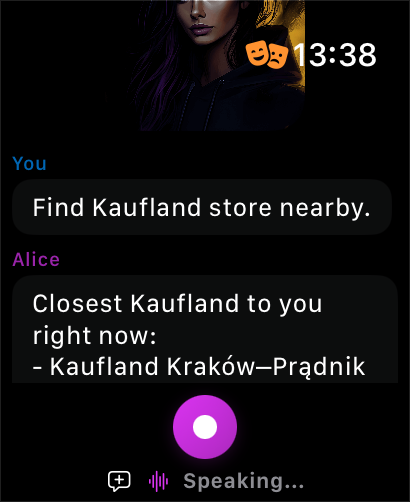

# Google Maps MCP Server

This server is a remote [Model Context Protocol](https://modelcontextprotocol.io) (MCP) server for Google Maps. It finds places, gives place details, and plans routes. It uses the Google Maps Platform [Places API (New)](https://developers.google.com/maps/documentation/places/web-service/op-overview) and [Routes API](https://developers.google.com/maps/documentation/routes).

The server runs on **Cloudflare Workers** and on **Bun**. It is built on the [MCP server template](https://github.com/iceener/streamable-mcp-server-template), version 2.1, and the official [MCP TypeScript SDK](https://github.com/modelcontextprotocol/typescript-sdk) 2.3.0. It uses protocol version `2026-07-28`. It also accepts clients that use the 2025 protocol versions.

The server is for agents that know the location of the user, for example on a watch or a phone. The client gives the current position, and the model can:

- Find places near the user, by type or by name.
- Read the opening hours, ratings, reviews, contact data, and photos of a place.
- Get walking, driving, cycling, or transit directions.
- Compare the distance to several destinations.



## Tools

| Tool | Function |
|---|---|
| `search_places` | Finds places near a location. With `query`, it does a text search ("sushi", "Starbucks"). With `types`, it finds places of those types ("cafe", "pharmacy"). With neither, it finds all places in the radius. |
| `get_place` | Gives the details of a place from a `place_id`. Select the data with `fields`: `basic`, `contact`, `hours`, `reviews`, `photos`. |
| `get_route` | With one destination, gives a route, and turn-by-turn steps if you ask for them. With two or more destinations (25 maximum), compares the time and distance to each, and names the closest. |

Each tool gives text for the model and structured data. The tool descriptions give all inputs and outputs. All tools only read data.

Examples of requests:

- "Coffee near me": `search_places` with `types: ["cafe"]` and `open_now: true`.
- "Is the pharmacy on Main Street open?": `search_places`, then `get_place` with `fields: ["hours"]`.
- "Which is closer, A or B?": `get_route` with both places as destinations.

Photo results contain public image URLs that Google makes for each request. They never contain the API key.

## Connect a client

The server URL is the deployed Worker's `MCP_PUBLIC_URL`, for example `https://google-maps.<subdomain>.workers.dev/mcp`. Use the Streamable HTTP transport, and send the shared token in the `Authorization` header.

| Client | Procedure |
|---|---|
| Alice | Add an MCP server. Set the URL, the type `streamable-http`, and the header `Authorization: Bearer <BEARER_TOKEN>`. |
| Claude Code | Run `claude mcp add --transport http google-maps <server URL> --header "Authorization: Bearer <BEARER_TOKEN>"`. |
| MCP Inspector | Run `bun run inspector`. Select **Streamable HTTP**. Enter the URL. Add the `Authorization` header under **Authentication**. |

The client must give the model the current location of the user and the current time. The tools use both.

## Authentication

Production uses `AUTH_MODE=bearer`. All clients send the same secret token, `BEARER_TOKEN`, as `Authorization: Bearer <token>`. The server compares the token in constant time. A request without the correct token gets `401`. The server publishes no OAuth documents, so clients do not try to sign in.

The Google API key (`API_KEY`) is a different secret. The server sends it to Google only, in the `X-Goog-Api-Key` header. The server never accepts a key from a client, and it never sends the client's token to Google.

For the authentication modes of the template, refer to the template's [docs/auth.md](https://github.com/iceener/streamable-mcp-server-template/blob/main/docs/auth.md).

## Configuration

The server identity (name, version, and instructions) is in `src/server.ts`. The deployment settings are environment variables. On Workers, the production values are in `wrangler.production.jsonc`, which is gitignored; `wrangler.production.example.jsonc` shows its shape.

| Variable | Production value | Function |
|---|---|---|
| `MCP_PUBLIC_URL` | `https://google-maps.<subdomain>.workers.dev/mcp` | The public URL of the endpoint. |
| `MCP_ALLOWED_HOSTS` | `google-maps.<subdomain>.workers.dev` | The `Host` headers that the server accepts. |
| `MCP_ALLOWED_ORIGIN_HOSTNAMES` | The worker host, `claude.ai`, `claude.com`, and the Alice hosts | The browser `Origin` headers that the server accepts. |
| `MCP_LEGACY_MODE` | `stateless` | Serves 2025-era clients without sessions. |
| `MCP_MAX_REQUEST_BYTES` | `1048576` | The largest request body. |
| `AUTH_MODE` | `bearer` | The authentication mode. |
| `LOG_LEVEL` | `info` | `debug`, `info`, `warning`, or `error`. |
| `BEARER_TOKEN` | Secret | The shared token for clients. It must not contain whitespace. The server ignores whitespace at the start and at the end. |
| `API_KEY` | Secret | The Google Maps Platform API key. The server does not start without it. |
| `GOOGLE_API_ORIGIN` | Not set | For tests only. It sends Google requests to a loopback mock. |

`.env.example` describes all variables for Bun. If the configuration is not valid, Bun does not start, and a Worker answers `500 {"error":"server_misconfigured"}` to all requests. The log gives each problem.

## Set up Google Maps Platform

1. In the [Google Cloud console](https://console.cloud.google.com), select or create a project.
2. Enable **Places API (New)** and **Routes API**.
3. Create an API key. Restrict it to these two APIs.
4. Store the key as the `API_KEY` secret.

For the requests that the server sends to Google, refer to [docs/google-maps.md](docs/google-maps.md).

## Deployment

`bun run deploy` deploys the `google-maps` Worker with `wrangler deploy --config wrangler.production.jsonc`. Before you deploy, read [docs/deploy.md](docs/deploy.md). It gives the secret names and the checks to do after a deployment.

## Development

1. Install the dependencies:

   ```sh
   bun install
   ```

2. Copy `.env.example` to `.env`. Set `API_KEY`.
3. Start the server:

   ```sh
   bun run dev
   ```

The server URL is `http://127.0.0.1:3000/mcp`. To use the Cloudflare local runtime, put `API_KEY` in `.dev.vars` and run `bun run dev:worker`. The URL is then `http://127.0.0.1:8787/mcp`.

| Script | Function |
|---|---|
| `bun run check` | Does the type check, the lint check, and the tests. It also checks the generated Worker types. |
| `bun run test:smoke` | Starts the real server on Bun and on workerd, and calls each tool through a loopback Google mock. It requires Node.js 22.18 or later. |
| `bun run deploy` | Deploys to Cloudflare with the `production` settings. |
| `bun run types:worker` | Makes the Worker types again. Run it after you change `wrangler.jsonc`. |

The tests do not send requests to Google. `tests/contract.test.ts` makes sure that the tool names and input schemas do not change. `tests/routes.test.ts` makes sure that each public route gives the same status as before the template migration.

### Project structure

```
src/
  server.ts       Server identity, dependencies, McpServer factory
  settings.ts     API_KEY and the test-only Google origin
  tools/          search_places, get_place, get_route. index.ts gives the order.
  services/       google-maps.ts: the Places API and Routes API client
  platform/       Template code. Do not change it.
  bun.ts          Entry point for Bun
  worker.ts       Entry point for Cloudflare Workers
tests/            Tool, service, contract, and route tests, and the template's platform tests
scripts/          Smoke tests and the loopback Google mock
```

For the template's design, refer to its [docs/architecture.md](https://github.com/iceener/streamable-mcp-server-template/blob/main/docs/architecture.md) and [docs/tools.md](https://github.com/iceener/streamable-mcp-server-template/blob/main/docs/tools.md).

## License

MIT
